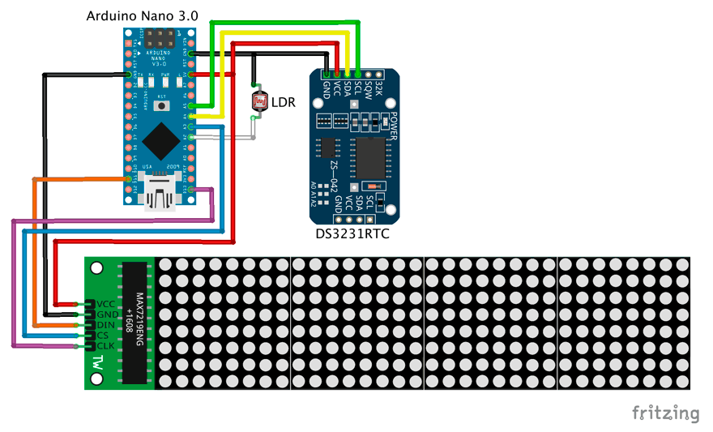
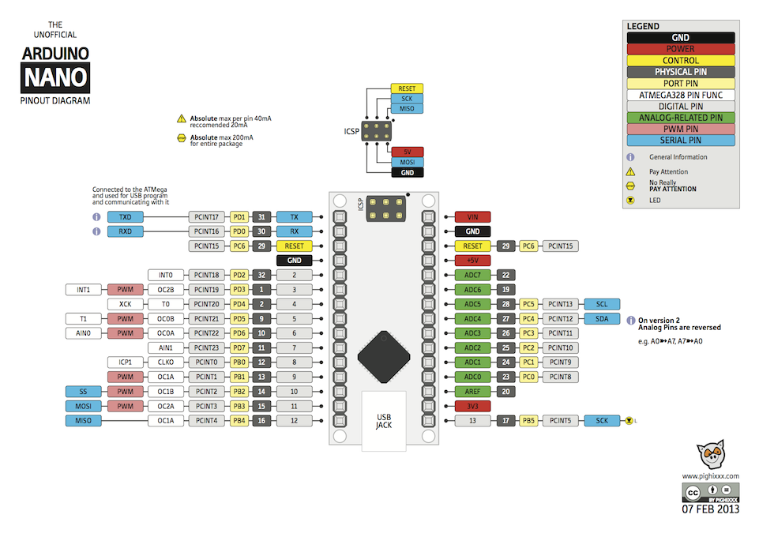

# Arduino 32x8 LED Dot Matrix Clock

A simple LED dot matrix clock project based on Arduino Nano (ATmega328 chip).

#### Schematics:


###### Arduino Nano 3.0:


#### Parts:
* Arduino Nano 3.0 (ATmega328).
* Real Time Clock DS3231RTC.
* 32x8 LED Dot Matrix Display Module (with MAX7219 chip).
* LDR sensor.

#### Instructions:

To set the clock, use the Arduino IDE Serial Monitor and follow on screen instructions.

###### Serial Monitor output:

```
>> Arduino 32x8 LED Dot Matrix Clock!
>> Use <dd/mm/yyyy hh:mm:ss> format to set clock's date and hour!
```